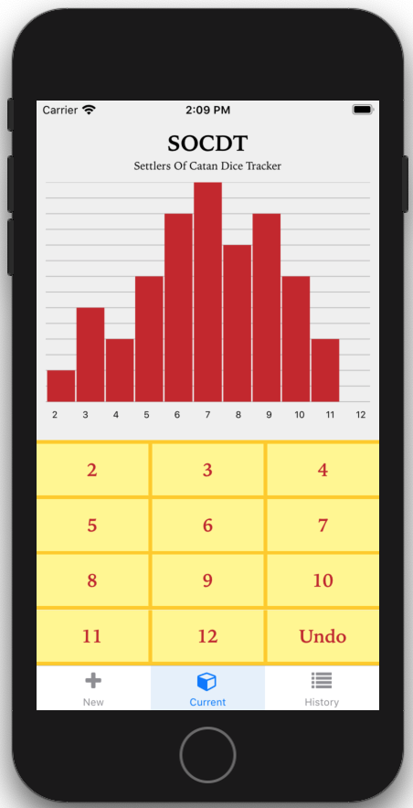
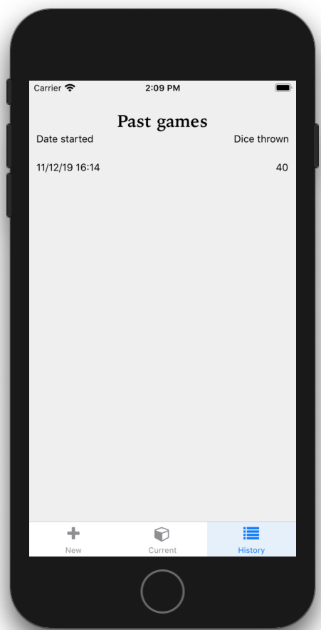

# SOCDT
Settlers of Catan Dice Tracker

## Description
Unofficial mobile app created in `react-native` to track the dice in <a href="https://www.catan.com/">Settlers of Catan™</a>.

## App preview



## Installation
Once you have downloaded or cloned this repository, run `npm install` inside the directory.

## Run the app
You need to have either the IOS development kit or the Android SDK. and then run one of the following commands:
```
react-native run-ios
react-native run-android
```

## Build for Android
You should edit the file `gradle.properties` and add the following fields
```
MYAPP_UPLOAD_STORE_FILE=XXXX
MYAPP_UPLOAD_KEY_ALIAS=XXXX
MYAPP_UPLOAD_STORE_PASSWORD=XXXX
MYAPP_UPLOAD_KEY_PASSWORD=XXXX
```

Once done that, run the following commands:

```
cd android
./gradlew assembleReleas
```

For more information about how to build for Android, check this link <a href="https://facebook.github.io/react-native/docs/signed-apk-android">Publishing to Google Play Store</a>

### More information
This app has been created with the purpose of learning how to use React Native, PRs are welcome.
